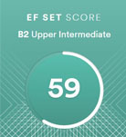

# Vladislav Nikishin
---
### Contact information
- **E-mail:** Nik_vladislav@outlook.com
- **Telegram:** @Liester
- **Discord:** liestreadt#9712
---
### About Myself
I have been working as a research engineer at Mordovian State University for a couple of years, and before that I studied physics for six years. Starting in 2020, I began to catch myself thinking that programming attracts me more than physics itself. Around the summer of 21, I decided to start self-learning programming. I chose the profession of a front-end developer, as I consider this profession to be optimal for a beginner. Studying at the university allows you to get a lot of soft skills, so at the moment I'm focused on getting hard skills and compiling my portfolio in my spare time. If I successfully complete my studies at Rolling Scopes School and receive a certificate, I plan to start going to interviews and try to get a new job.

---
### Skills
- HTML5 / CSS3
- JavaScript (ES6+)
- Git / GitHub
- Pug (basics)
- SASS / SCSS (basics)
- Gulp / WebPack (basics)
---
### Code Example
__The Hashtag Generator KATA from CODEWARS:__
It must start with a hashtag (#).
All words must have their first letter capitalized.
If the final result is longer than 140 chars it must return false.
If the input or the result is an empty string it must return false.
```
function generateHashtag(str) {
  if (str.trim() == '') return false;
  let arr = str.split(' ').map(elem => elem ? elem[0].toUpperCase() + elem.slice(1) : '');
  arr.unshift('#');
  let result = arr.join('');
  if (result.length > 140) return false;
  return result;
}
```
---

### Experience
- [Гостевая книга (HTML, CSS, JS)](https://github.com/liestreadt/animated-web-page) (final task of the 1st part of the Kokoc Group courses)

- [Продвинутая вёрстка (pug, SCSS, gulp)](https://github.com/liestreadt/kokoc-group-2nd-stage-final-task) (final task of the 2st part of the Kokoc Group courses)
---

### Education
__Univeristy:__
- MRSU 2020 (master of physics)

__Courses:__
- [Kokoc Group Saransk](https://vk.com/kokocsaransk?w=wall-171508340_41)
- JavaScript Manual on [learn.javascript.ru](https://learn.javascript.ru/)

---
### Languages
Russian - native

English - upper-intermediate (according to [ES FET certificate](https://www.efset.org/cert/Mu9Xgc))

[](https://www.efset.org/cert/Mu9Xgc)

---